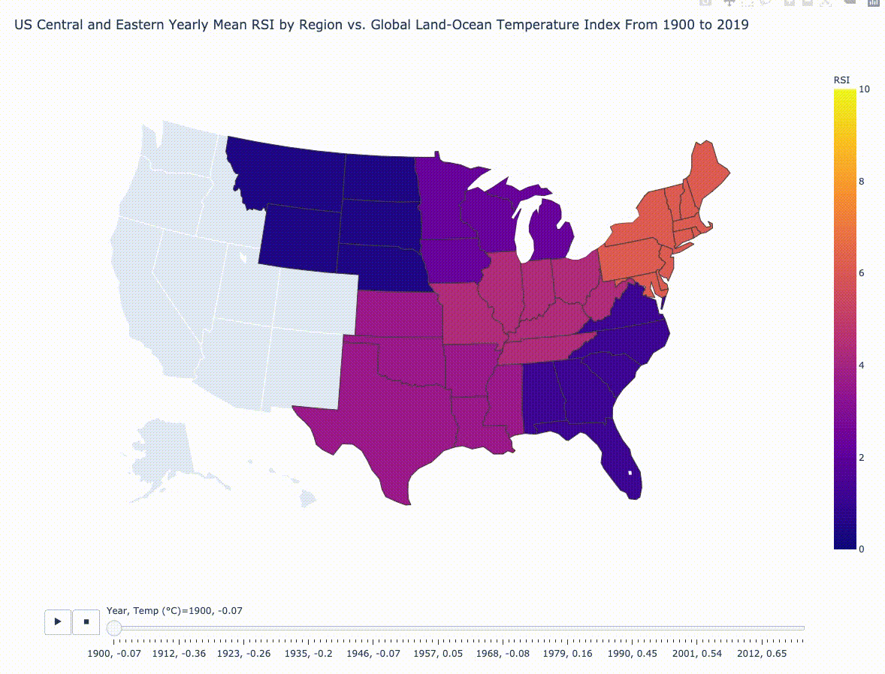
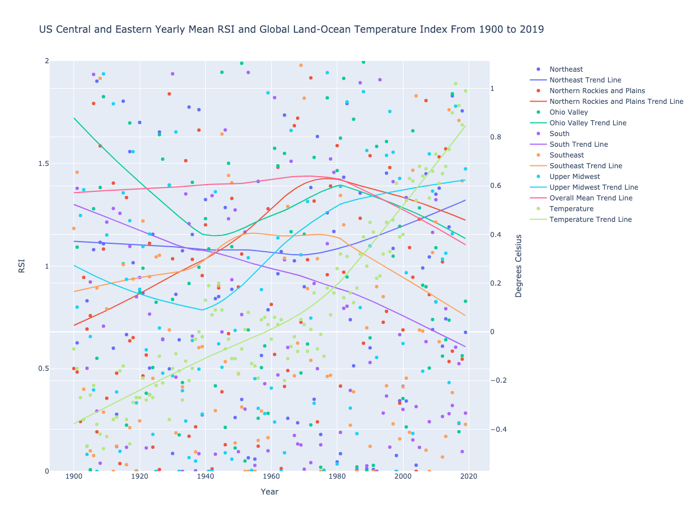

# CSC110 Project -- US Snowfall vs. Global Land-Ocean Temperature Index

This repository contains datasets and code for a CSC110 project analyzing US Regional Snowfall Index data and global land-ocean temperature index data.

The snowfall data was obtained from the NCEI, specifically at [this link](https://www.ncei.noaa.gov/data/regional-snowfall-index/access/regional-snowfall-index_c20191218.csv), and the temperature data was sourced from NASA's website at [this link](https://data.giss.nasa.gov/gistemp/graphs/graph_data/Global_Mean_Estimates_based_on_Land_and_Ocean_Data/graph.txt).

To learn about our results/findings, check out the [report](./report) folder.

## Result Previews

### Choropleth

### Year Comparison Scatterplot

### Correlation Scatterplot

